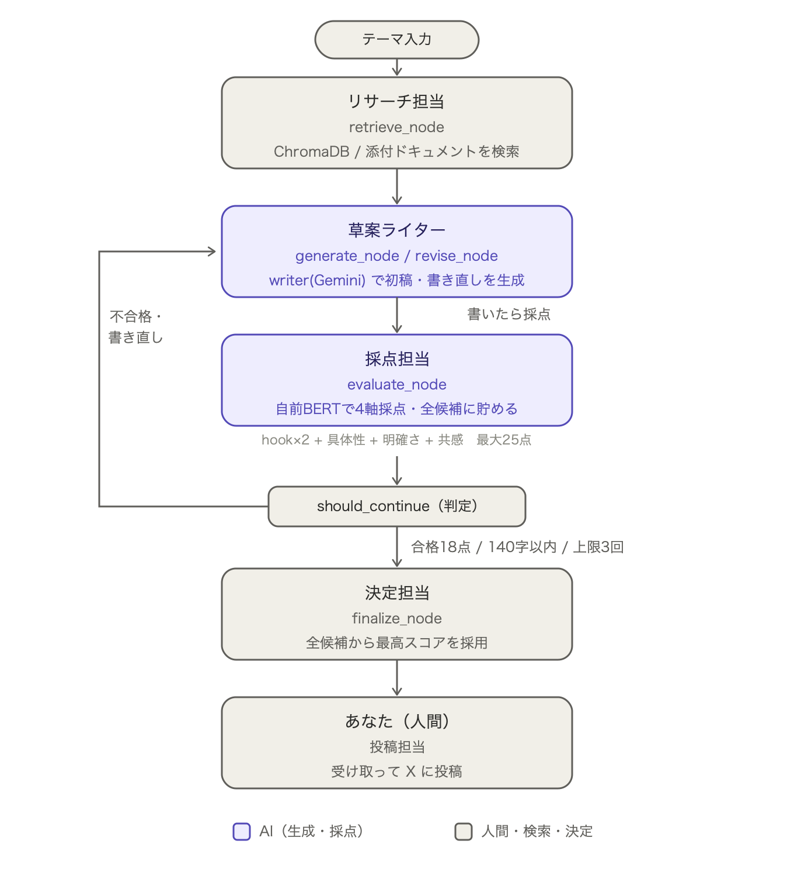

# AgentMark

**「作れたけど、広めるのが苦手」な個人開発者のための、X（旧Twitter）投稿自動生成AIエージェント。**

プロダクト情報を渡してテーマを選ぶだけで、投稿案をAIが生成→自動採点→基準に届かなければ自己修正、を繰り返して1本に仕上げる。作者自身が最初のユーザーで、このエージェントで自分のプロダクトの投稿を作りながら開発している。

**ダウンロードしてローカルで動かすアプリ。** 公開ホスティングはせず、あえて手元だけで動かしている。理由は[コンセプト](#コンセプト-ローカルで育てるagentmark)を参照。

---

## 背景・なぜ作ったか

個人開発をしていて、いつも同じところでつまずいていた。「作る」のはできても「広める」のが苦手で、良いものを作っても誰にも知られずに終わる。

生成AIのおかげで「作る」のハードルはどんどん下がっているのに、「広める」はまだ手つかずの領域だと感じた。それなら、その部分こそAIエージェントに任せられるはず——というのがこのプロジェクトの出発点。

汎用的に「バズる投稿を書いて」と頼むのではなく、**自分のプロダクト固有の情報に基づいて**投稿を作り、**書きっぱなしにせず採点して直す**ところまでをエージェントにやらせている。

---

## コンセプト：ローカルで育てるAgentMark

このツールは、公開Webサービスにはせず、**あえてローカル環境だけで動かす**ように作っている。理由は2つ。

1. **使うほど自分専用に育つ** — 手元で使い続けるたびに、自分の投稿・自分の良い/悪い評価・自分の実際のエンゲージメントがローカルに貯まる。そのデータで採点モデル（BERT）を再学習し、汎用の「それっぽい採点」から「自分の審美眼に近い採点」へ育てていく
2. **公開する前に、まず信頼できる形にする** — LLM-as-a-Judgeの採点をそのまま信用せず、自前モデル・人間評価・実エンゲージメントを突き合わせて検証してから、初めて他の人にも使える形にする

### 将来のシナリオ：ワークフロー型エージェント1体 → AIマーケティング部署へ

今のAgentMarkは「テーマを渡すと1投稿を作る」ワークフロー型のエージェント1体（[アーキテクチャ](#アーキテクチャ)を参照）。
これを、リサーチ・ライティング・採点・分析・戦略提案を専門分業する複数のエージェントに分割し、
1つの**「AIマーケティング部署」**として機能させることを最終的なゴールに見据えている。

```
現在地 ── ローカルで「1投稿を作る」ワークフロー型エージェント
   │       generate → evaluate → revise の自己修正ループ(LangGraph)
   ↓
次   ── ローカルで採点モデルを自分のデータに特化させる
   │       人間評価を貯める → BERTファインチューニング → judge/自前モデル/人間の一致を検証
   ↓
先   ── 生成品質・採点精度が安定したら、複数エージェントに分業してマーケティング部署化
           リサーチ担当・ライター・編集(採点)・分析担当、を連携させて運用する
```

---

## 実際の生成結果

テーマ「どんな人に使ってほしいか」を渡したときの、実際の生成ログ（`data/posts.csv` に記録）。

> **どんな人に使ってほしいか**
>
> 「せっかく作ったアプリ、誰にも知られず埋もれていませんか？」マーケティングで消耗する個人開発者のあなたへ。
>
> AgentMarkは、あなたのプロダクト情報から投稿案を自動生成。さらにAIが採点・修正を繰り返し、刺さる文章に進化させます。「良いもの」を「届く」に変えませんか？

自動採点 8点（合格）・人間評価 (👍good or bad)

---

## 主な機能

- プロダクト情報をRAGで参照して投稿を生成（ChromaDB）。他プロダクトでも、README/LP/PDF/URL/直接入力から投稿を作れる
- 1案ずつ「生成 → 採点 → 書き直し」を繰り返す自己修正ループ（LangGraph）
- ループ中に作った全案から一番点数の高い案を最終採用
- 採点は自前学習のBERTモデルのみで行う（LLMはジャッジに使わない。生成はGeminiを使う）
- テーマはプリセットから選ぶか自由入力。文字数カウント・コピーボタン付きのWebUI（Streamlit）
- 投稿を人間が👍/👎評価して蓄積し、採点モデルの精度検証・再学習に使う評価ダッシュボード
- AIエージェント部署の設計図をUIから確認できる

---

## アーキテクチャ

各ノードを「マーケティング部署の担当者」に見立てた設計図。紫が生成AI（Gemini/BERT）を使う担当、グレーが人間・検索・決定。



### 処理フロー（LangGraph）

```
START
  → retrieve   : テーマでベクトルDBを検索し、関連情報をcontextに載せる
  → generate   : 初稿を1つ書く（Gemini）
  → evaluate   : 採点して候補リストに貯める（自前BERT）
  → should_continue 判定:
        合格ライン(18点)以上 かつ 140字以内 → finalize へ
        修正3回に到達            → finalize へ（不合格でも打ち切り）
        それ以外                → revise: 採点コメントをもとに書き直し → evaluate へ戻る
  → finalize   : 貯めた全案の中から一番点数の高い案を最終採用
END
```

「1案ずつ生成→採点→書き直し」の逐次ループで、初稿も修正稿も必ず採点を通す。途中の最高点が最終案になるとは限らない ——全候補から一番良い案を選ぶ。

---

## 採点の仕組み — LLM Judgeから自前MLモデルへ

投稿は4軸で採点する: **hook**（冒頭の引きの強さ）・**specificity**（具体性）・**clarity**（明確さ・一貫性）・**relatability**（共感・自分ごと化）、それに総合の **binary**（good/bad）。合計点 `2*hook + specificity + clarity + relatability`（最大25点）が合格ライン18点を超え、かつ140字以内なら合格。

このプロジェクトの技術的な核心は「採点をどう信用できるものにするか」という点にある。

最初はGemini(LLM-as-a-Judge)に構造化出力で採点させていた。手軽だが基準がブレやすく、コスト・待ち時間もかかる（投稿1本でGeminiを最大8回呼ぶ計算になる）。この構成に頼り続けると「LLMが良いと言った投稿をLLMが採点して合格にする」という自己参照ループになり、判断基準を検証できない。

そこで、人間の評価データを貯めて **`cl-tohoku/bert-base-japanese-v3` をファインチューニングした自前モデル** に採点を完全移行した。**現在、生成ループの採点はこの自前BERTモデルのみで行い、LLMはジャッジとして一切使わない**（生成そのものはGeminiを使う）。

```
投稿テキスト
  ↓ BertTokenizer
BERT (cl-tohoku/bert-base-japanese-v3)
  ↓ [CLS]トークンの768次元ベクトル
  ├─ hook_head         → Linear(768→1) + sigmoid → 1〜5
  ├─ specificity_head  → Linear(768→1) + sigmoid → 1〜5
  ├─ clarity_head      → Linear(768→1) + sigmoid → 1〜5
  ├─ relatability_head → Linear(768→1) + sigmoid → 1〜5
  └─ binary_head       → Linear(768→2) → good/bad
```

損失は回帰4軸のMSE＋分類のCrossEntropyの合成、最適化はAdamW（lr=2e-5）。学習は`python notebooks/train_evaluator.py`一発でローカル完結（同じ構成のColab版`notebooks/post_evaluator.ipynb`もある）。学習済みモデル(`local/models/post_evaluator/`)はサイズが大きいためGit管理外で、[ローカルで使う](#ローカルで使う)には別途学習が必要（下記参照）。

判断基準の検証は継続中で、評価タブで以下を確認できる: LLM judge時代の記録 vs 自前モデル vs 人間評価の一致度、軸別のズレ、reviseループの効き、合格ラインの妥当性。

---

## 技術スタック

| 役割 | 使用技術 |
|---|---|
| LLM・生成 | Gemini 2.5 Flash |
| エージェント | LangGraph |
| RAG | LangChain + ChromaDB |
| 埋め込み | ローカル埋め込みモデル（`intfloat/multilingual-e5-small`, sentence-transformers。API課金なし） |
| 採点 | 自前ファインチューニングBERT（`cl-tohoku/bert-base-japanese-v3`, PyTorch）。LLMはジャッジに使わない |
| UI | Streamlit（ローカル実行のみ） |

---

## ファイル構成

```
marketing_agent/
├── app.py                  Streamlitアプリ本体（① 生成 / ② 評価 をタブで切替）
├── main.py                 CLIエントリポイント
├── index.py                ベクトル化専用。product.md更新時だけ実行
├── analyze_posts.py        投稿物DBの集計をCLIで見る
├── config.py               全設定を一箇所に集約(モデル名・パス・閾値)
├── product.md / playbook.md  プロダクト情報 / 伸びる投稿の型(RAGの参照元)
│
├── core/                   エージェント本体(LangGraph)
│   ├── nodes.py            各ノード(retrieve/generate/evaluate/revise/finalize)とState
│   ├── graph.py            ノードとエッジをつないでappを組み立てる
│   ├── models.py           AIモデルの窓口・採点スキーマ(Evaluation)
│   ├── rag.py              検索(ChromaDB) + 添付ドキュメント用の in-memory 検索
│   └── sources.py          添付ソース読取(PDF/テキスト/URL)
│
├── ui/                     Streamlit UI
│   ├── views_generate.py   生成ページ(4ステップのウィザード)
│   ├── views_evaluate.py   評価ダッシュボード(採点精度・軸ズレ・投稿一覧の編集)
│   ├── ui_common.py        set_page_config + CSS
│   └── agent_diagram.py    部署の設計図(SVG生成 + PNG書き出し)
│
├── scoring/                採点・投稿物DB
│   ├── posts.py            投稿物DB(CSV)の読み書き・集計
│   └── local_evaluator.py  自前BERTモデルのローカル推論
│
├── data/posts.csv          投稿物DB本体(1投稿=1行。使うほど貯まっていく)
├── docs/scoring_rubric.md  採点ルーブリック(4軸+binaryの定義)
├── notebooks/              BERTファインチューニング
│   ├── train_evaluator.py  コマンドでローカル学習(Colab不要)
│   ├── post_evaluator.ipynb  同じ内容のColab版(GPUを使いたい時)
│   ├── gen_labels.py       学習データ(labels.jsonl)の生成スクリプト
│   └── labels.jsonl        学習データ本体(116件)
│
└── local/                  Git管理外。生成物・DL物をまとめて格納
    ├── chroma_db/          ベクトルDB(index.py実行で生成)
    └── models/             採点モデルの重み(下記「採点モデルを配置する」参照)
```

---

## ローカルで使う

以下を上から順にターミナルにコピー&ペーストしていけば動く（`.env`へのAPIキー貼り付けだけ手動）。
動作確認済み: Python 3.11 / 3.13、macOS。

### 1. ダウンロード

git がある場合:

```bash
git clone https://github.com/rikky300/marketing_agent.git
cd marketing_agent
```

git を使わない場合は、GitHubの `Code → Download ZIP` からダウンロードして展開し、そのフォルダにターミナルで移動する（`cd` の後は展開したフォルダ名に読み替える）。

```bash
cd marketing_agent-main
```

### 2. 環境構築

```bash
python -m venv .venv
source .venv/bin/activate   # Windows(PowerShell): .venv\Scripts\Activate.ps1
pip install -r requirements.txt
```

`torch` / `transformers` / `sentence-transformers` を含むため、初回インストールは数分・合計2GB前後かかる（採点モデル用・埋め込みモデル用）。

### 3. APIキーを設定

```bash
echo "GOOGLE_API_KEY=" > .env
```

[Google AI Studio](https://aistudio.google.com/apikey) でキーを発行し、`.env` を開いて `=` の後ろに貼り付ける。

```
GOOGLE_API_KEY=ここに発行したキーを貼り付け
```

（生成に使うGemini用のキーのみでよい。埋め込みはローカルモデルなのでAPIキー不要）

### 4. 採点モデルを学習して配置する

投稿の採点は自前ファインチューニング済みのBERTモデルのみで行う（LLMはジャッジに使わない設計のため、これが無いと生成ループが止まる）。コマンド一発でローカル学習できる（Colab/Jupyter不要）。

```bash
python notebooks/train_evaluator.py
```

`notebooks/labels.jsonl`（同梱の116件のラベル付きデータ）で学習し、`local/models/post_evaluator/`（`local/` はGit管理外。生成物・DL物をまとめる場所）に保存する。GPUがあれば自動で使う。CPUのみでも既定10エポックが数分で終わる程度の小さいデータ量。

```
local/models/post_evaluator/
├── pytorch_model.pt        BERT本体+5ヘッドの重み(約440MB)
├── tokenizer_config.json / vocab.txt
└── meta.json
```

エポック数や保存先は引数で変えられる（`python notebooks/train_evaluator.py --epochs 5 --out 別の場所`）。より大きい学習環境(GPU)を使いたい場合は、同じ構成の `notebooks/post_evaluator.ipynb`（Google Colab用）も用意している。

（サイズが大きくGit管理外のため同梱していない。自分でnotebookを回して学習するか、学習済みモデルの提供を受けて配置する）

### 5. ベクトルDBを作成して起動

```bash
python index.py
streamlit run app.py
```

ブラウザで `http://localhost:8501` が自動的に開く。初回は埋め込みモデル(`intfloat/multilingual-e5-small`、約470MB)がHugging Faceから自動ダウンロードされる。「① 生成」タブでテーマを選んで投稿を作り、「② 評価」タブで👍/👎の内訳や採点精度を確認できる。

ここまでで、同梱の`product.md`（AgentMark自身の製品情報）を題材に投稿が生成できるはず。CLIだけで試したい場合は `python main.py`。

---

## 自分のプロダクトに使う場合

同梱の `product.md` はAgentMark自身の製品情報（サンプル兼、作者の実利用データ）。自分のプロダクトで使うには:

### 1. `product.md` を書き換える

特徴・ターゲット・開発の背景などを自分のプロダクトの内容に置き換える。

```markdown
# アプリ名

一言説明。

## 特徴
- 特徴1
- 特徴2

## 誰のためか
ターゲットの説明。

## なぜ作ったか
開発の背景。
```

### 2. ベクトルDBを作り直す

```bash
python index.py
```

### 3.（任意）投稿の型を自分好みに調整する

`playbook.md`（伸びる投稿の型。生成時に全文差し込まれる）を編集すると、生成される投稿のトーンや型を調整できる。

### 4. 自分の内容をGitHubに上げないようにする

`product.md` はサンプルとしてリポジトリにコミット済みのファイルなので、自分の内容に書き換えた後にそのまま`git push`すると、上流のGitHubリポジトリに反映されてしまう。上げたくない場合は、たとえば以下のどちらか。

```bash
# 方法A: この後 git に変更を反映させない(pushしない/コミットしない)ならこのままでOK

# 方法B: 以後 product.md の変更をgitに追跡させない
git update-index --skip-worktree product.md
```

ZIPでダウンロードした場合はそもそもgit管理下にないので、この心配は不要。

---

## 今後の展望

- [ ] 人間評価を100件以上貯めて、BERTモデルを本番データで再学習
- [ ] LLM judge・自前モデル・人間評価の一致率を検証し、生成ループの採点を自前モデルに切り替え
- [ ] 事実忠実性（プロダクト情報への忠実さ）を採点する軸を追加
- [ ] 伸びた投稿をplaybookに追記するフィードバックループ
- [ ] 生成品質・採点精度が安定したら、リサーチ・ライティング・採点・分析を専門分業する複数エージェントに分割し、AIマーケティング部署として運用する

---

## 開発の経緯

1個のファイルで生成→採点→表示を実装 → 採点をPydantic構造化出力（LLM-as-a-Judge）で実装 → 採点基準をルーブリック化 → LangGraphで自己修正ループを実装 → RAG追加（InMemory→ChromaDB） → 役割ごとにファイル分割 → Streamlit UIを実装 → 生成フローを「1案ずつ生成→採点→書き直し」の逐次ループに変更 → 投稿物DBと評価ダッシュボードを分離 → 添付ソース（PDF/URL/手入力）から生成できるように拡張 → BERT採点モデルのファインチューニング環境をColabで構築 → 生成と評価を1つのローカルアプリに統合（現在ここ）
