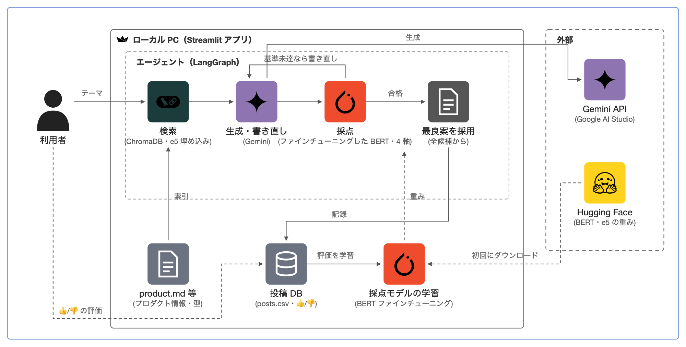

# AgentMark

「作れたけど、広めるのが苦手」な個人開発者のための、X（旧Twitter）投稿を作る AI エージェント。
プロダクト情報をもとに **生成 → 自前の BERT で採点 → 基準未達なら書き直し** を繰り返し、一番点の高い案を 1 本採用する。

公開ホスティングはせず、ローカルで動かす（使うほど自分の評価データが貯まり、採点モデルを自分好みに育てるため）。

## 構成


| 段階 | 中身 |
|---|---|
| 検索 | `product.md` などのプロダクト情報を ChromaDB に索引し、テーマに合う部分を取り出す（埋め込みはローカルの `multilingual-e5-small`） |
| 生成・書き直し | Gemini 2.5 Flash |
| 採点 | 自前で微調整した BERT（`cl-tohoku/bert-base-japanese-v3`）。LLM は採点に使わない |
| 判定 | 合格（25 点中 18 点以上・140 字以内）か、書き直し 3 回で終了 → 全候補から最高点を採用 |
| 育てる | 生成した投稿に 👍/👎 を付けて蓄積 → 採点モデルを再学習 |

## 採点モデル — LLM-as-a-Judge から自前モデルへ
最初は Gemini に採点させていたが、基準がぶれる・遅い・「LLM が書いたものを LLM が合格にする」自己参照になる、という問題があった。
人の評価データで BERT を微調整し、採点を完全に置き換えた。

```
投稿 → BERT → [CLS] 768 次元
        ├ hook / specificity / clarity / relatability … 回帰（1〜5）
        └ binary … good / bad の分類
損失 = 4 軸の MSE + 分類の CrossEntropy（AdamW, lr 2e-5）
合計点 = 2×hook + specificity + clarity + relatability（最大 25）
```

## 使い方
```bash
git clone https://github.com/rikky300/marketing_agent.git && cd marketing_agent
python -m venv .venv && source .venv/bin/activate && pip install -r requirements.txt
echo "GOOGLE_API_KEY=<Google AI Studio のキー>" > .env
python notebooks/train_evaluator.py   # 採点モデルを学習（同梱の 116 件、CPU で数分）
python index.py                       # プロダクト情報を索引
streamlit run app.py                  # http://localhost:8501
```
自分のプロダクトに使う時は `product.md` を書き換えて `python index.py` をやり直す。

## 技術
Gemini 2.5 Flash / LangGraph / LangChain + ChromaDB / sentence-transformers / PyTorch・transformers（BERT）/ Streamlit

## 今後
- 人の評価を 100 件以上貯めて採点モデルを再学習し、人の評価との一致を検証する
- 伸びた投稿を `playbook.md` に足すフィードバックループ
- リサーチ・執筆・採点・分析を分担する複数エージェントの「AI マーケティング部署」へ
